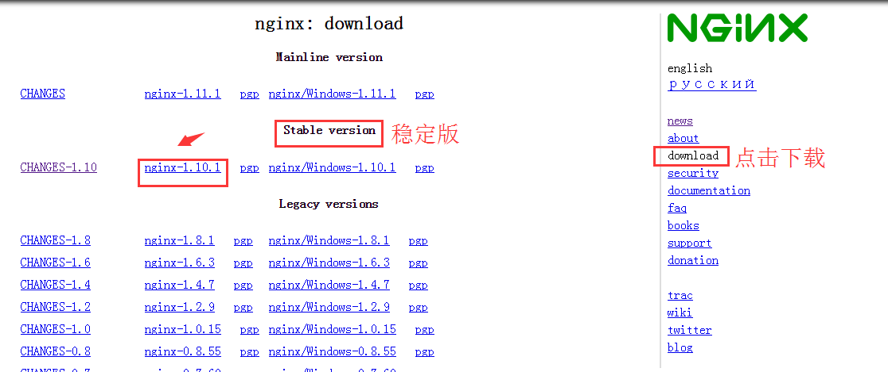

# Nginx1.10.1稳定版编译安装

##具体流程如下：

* 登录官网去下载编译包：[nginx官网](nginx.org)

<pre>
# wget http://nginx.org/download/nginx-1.10.1.tar.gz
</pre>

* 编译参数

<pre>
yum install -y  gcc  glibc gcc-c++ pcre-devel make openssl-devel
</pre>

* 创建普通用户及组

<pre>
useradd -s /sbin/nologin -M www
</pre>

* 编译

<pre>
./configure --prefix=/usr/local/nginx-1.10.1 --user=www --group=www --with-http_ssl_module  --with-http_gzip_static_module --with-http_stub_status_module 
make && make install
ln -s /usr/local/nginx-1.10.1/ /usr/local/nginx
</pre>

* 检查语法正确性及启动服务

<pre>
/usr/local/nginx/sbin/nginx -t
/usr/local/nginx/sbin/nginx
</pre>

